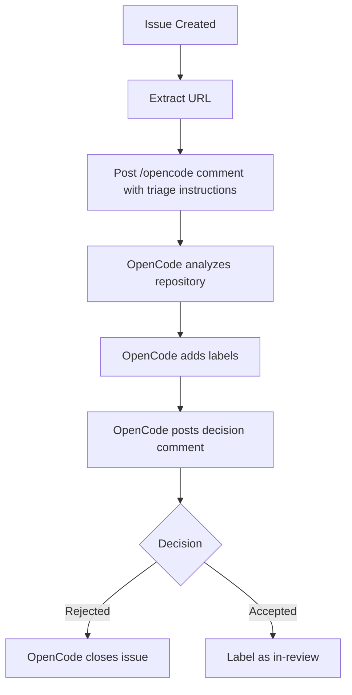
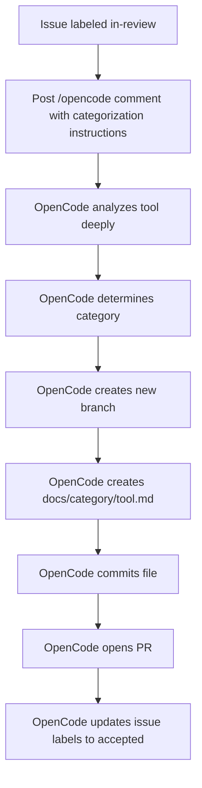
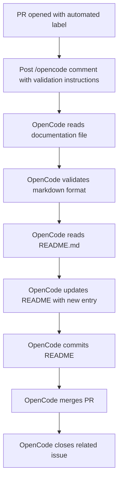
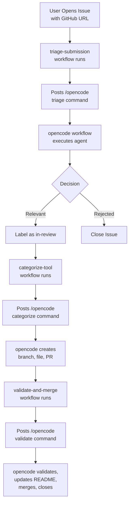

# Architecture Documentation

## System Overview

The Awesome OpenCode repository uses GitHub Actions and the OpenCode GitHub App to automatically triage, categorize, document, and merge tool submissions through a fully automated workflow.

## Core Components

### 1. OpenCode GitHub App Integration

**File:** `.github/workflows/opencode.yml`

The foundational workflow that enables OpenCode to respond to commands in issues and PRs.

```yaml
name: opencode
on:
  issue_comment:
    types: [created]
```

**How it works:**

- Listens for comments containing `/opencode` or `/oc`
- Runs OpenCode agent with Claude Sonnet 4
- OpenCode can read context, make changes, create branches, and interact with GitHub API
- All AI operations happen through this workflow

**Key Features:**

- Full repository access
- Can create/modify files
- Can manage issues and PRs
- Can create branches and commits

### 2. Orchestration Workflows

Three orchestration workflows trigger OpenCode commands at the right times:

#### A. Triage Submission (`.github/workflows/triage-submission.yml`)

**Trigger:** Issue opened with `submission` label

**Flow:**



**OpenCode Instructions:**

- Analyze if tool is relevant to AI coding assistance
- Provide JSON response with decision
- Add appropriate labels
- Close issue if rejected
- Post explanatory comment

#### B. Categorize Tool (`.github/workflows/categorize-tool.yml`)

**Trigger:** Issue labeled with `in-review`

**Flow:**



**OpenCode Instructions:**

- Categorize into one of 6 predefined categories
- Generate comprehensive documentation
- Create branch named `add-tool-{issue_number}`
- Create markdown file with specific format
- Open PR linking to issue
- Update issue labels

#### C. Validate and Merge (`.github/workflows/validate-and-merge.yml`)

**Trigger:** PR opened with `automated` label

**Flow:**



**OpenCode Instructions:**

- Validate documentation format
- Extract tool information
- Update README.md alphabetically
- Commit changes
- Merge PR if valid
- Close and comment on issue

## Data Flow


┌─────────────────────┐
│  User Opens Issue   │
│   with GitHub URL   │
└──────────┬──────────┘
           │
           ▼
┌─────────────────────┐
│ triage-submission   │
│   workflow runs     │
└──────────┬──────────┘
           │
           ▼
┌─────────────────────┐
│  Posts /opencode    │
│  triage command     │
└──────────┬──────────┘
           │
           ▼
┌─────────────────────┐
│  opencode workflow  │
│   executes agent    │
└──────────┬──────────┘
           │
     ┌─────┴─────┐
     │           │
     ▼           ▼
┌─────────┐ ┌─────────┐
│Relevant │ │Rejected │
│(label)  │ │(close)  │
└────┬────┘ └─────────┘
     │
     ▼
┌─────────────────────┐
│categorize-tool      │
│  workflow runs      │
└──────────┬──────────┘
           │
           ▼
┌─────────────────────┐
│  Posts /opencode    │
│ categorize command  │
└──────────┬──────────┘
           │
           ▼
┌─────────────────────┐
│  opencode creates   │
│ branch, file, PR    │
└──────────┬──────────┘
           │
           ▼
┌─────────────────────┐
│ validate-and-merge  │
│   workflow runs     │
└──────────┬──────────┘
           │
           ▼
┌─────────────────────┐
│  Posts /opencode    │
│  validate command   │
└──────────┬──────────┘
           │
           ▼
┌─────────────────────┐
│ opencode validates, │
│ updates README,     │
│ merges, closes      │

└─────────────────────┘
```

## Security Model

### Permissions

**OpenCode Workflow:**

```yaml
permissions:
  id-token: write # For authentication
  contents: write # To create/modify files
  pull-requests: write # To manage PRs
  issues: write # To manage issues
```

**Orchestration Workflows:**

```yaml
permissions:
  issues: write # To add comments
  contents: read/write # To checkout code
  pull-requests: write # For PR workflows
```

### Secrets

- `ANTHROPIC_API_KEY`: Required for Claude AI model
- No other secrets needed (uses GitHub App authentication)

### Access Control

- OpenCode runs in GitHub Actions runner (isolated environment)
- Only processes commands from issue/PR comments

- All changes are committed with GitHub Actions bot identity
- Requires OpenCode GitHub App installation

## Key Design Decisions

### 1. Comment-Based Triggers

**Why:** OpenCode GitHub integration works via `/opencode` commands in comments

**Benefits:**

- Leverages official OpenCode integration

- Transparent - all AI actions visible in comments
- Auditable - full history in issue/PR timeline
- Debuggable - can see exactly what OpenCode was asked to do

### 2. Orchestration Workflows

**Why:** GitHub Actions can't directly invoke OpenCode programmatically

**Solution:** Workflows post `/opencode` comments with detailed instructions

**Benefits:**

- Automatic triggering at the right lifecycle points
- Structured instructions for consistent behavior

- Separation of concerns (trigger vs execution)

### 3. Multi-Stage Process

**Why:** Complex workflow broken into discrete stages

**Stages:**

1. Triage (filter)
2. Categorize (analyze and document)
3. Validate and Merge (quality control)

**Benefits:**

- Each stage can fail independently

- Clear checkpoints for manual intervention
- Progressive refinement of data
- Better error handling

### 4. Label-Based State Machine

**States:**

- `submission` → Initial state
- `needs-triage` → Awaiting triage

- `in-review` → Approved, awaiting categorization
- `accepted` → Documented, awaiting merge
- `rejected` → Not relevant, closed

**Benefits:**

- Clear state transitions
- Easy to track progress
- Enables workflow triggers
- Human-readable status

## Customization Points

### 1. AI Model

Change in `opencode.yml`:

```yaml
with:
  model: anthropic/claude-sonnet-4-20250514
```

Options: Any model supported by OpenCode

### 2. Categories

Modify in `categorize-tool.yml` comment:

- Add new categories to the list
- Create corresponding docs directory
- Update README.md with new section

### 3. Triage Criteria

Edit in `triage-submission.yml` comment:

- Modify relevance criteria
- Adjust confidence thresholds
- Change decision logic

### 4. Documentation Format

Edit in `categorize-tool.yml` comment:

- Change markdown template
- Add/remove sections

- Modify metadata

## Monitoring and Debugging

### Check Workflow Runs

1. Go to **Actions** tab
2. Select a workflow
3. View logs for each step

### Debug OpenCode

1. Find the issue/PR in question
2. Look for `/opencode` comments
3. Check OpenCode's response comments
4. Review the linked Actions run

### Common Issues

**OpenCode not responding:**

- Check GitHub App is installed
- Verify ANTHROPIC_API_KEY is set
- Ensure comment has `/opencode` or `/oc`

**Wrong behavior:**

- Review the instruction comment
- Adjust prompt in workflow file
- Test with manual `/opencode` comment

**Workflow not triggering:**

- Check issue has correct label
- Verify workflow permissions
- Ensure workflows are in main branch

## Performance

### Typical Timeline

- **Triage:** 30-60 seconds
- **Categorize:** 60-120 seconds
- **Validate:** 30-60 seconds
- **Total:** 2-4 minutes from submission to merge

### Resource Usage

- **GitHub Actions:** ~5-10 minutes per submission
- **Anthropic API:** 3 requests per submission
- **Cost:** ~$0.01-0.05 per submission (API costs)

## Future Enhancements

### Potential Improvements

1. **Duplicate Detection** - Check if tool already exists
2. **Batch Processing** - Handle multiple submissions
3. **Quality Metrics** - Track documentation quality
4. **Health Monitoring** - Check if tools still active
5. **Popularity Tracking** - Add star counts, last update
6. **Search Index** - Generate searchable index
7. **RSS Feed** - Subscribe to new additions

### Integration Opportunities

1. **Notifications** - Slack/Discord webhooks
2. **Analytics** - Track submission patterns
3. **API** - Expose data programmatically
4. **Web UI** - Browse and search tools
5. **CI/CD** - Run tests on submissions

## References

- [OpenCode GitHub Integration](https://opencode.ai/docs/github/)
- [GitHub Actions Documentation](https://docs.github.com/actions)
- [OpenCode App](https://github.com/apps/opencode-agent)
- [Anthropic API](https://docs.anthropic.com/)
